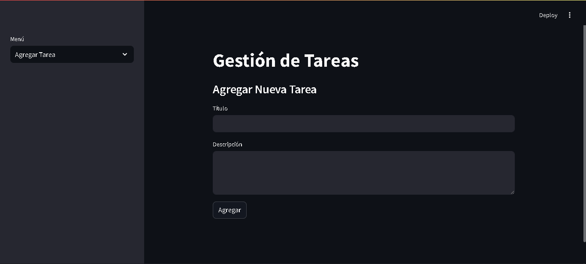
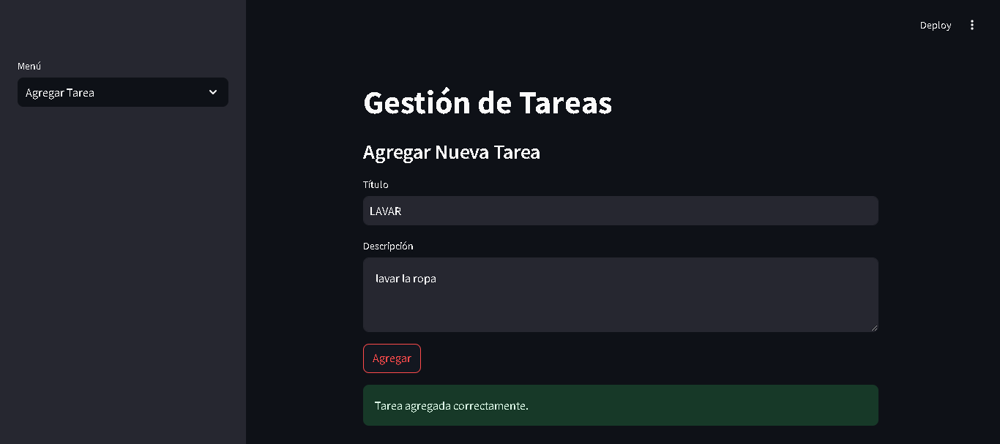
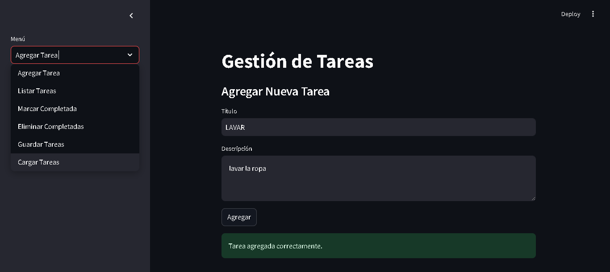
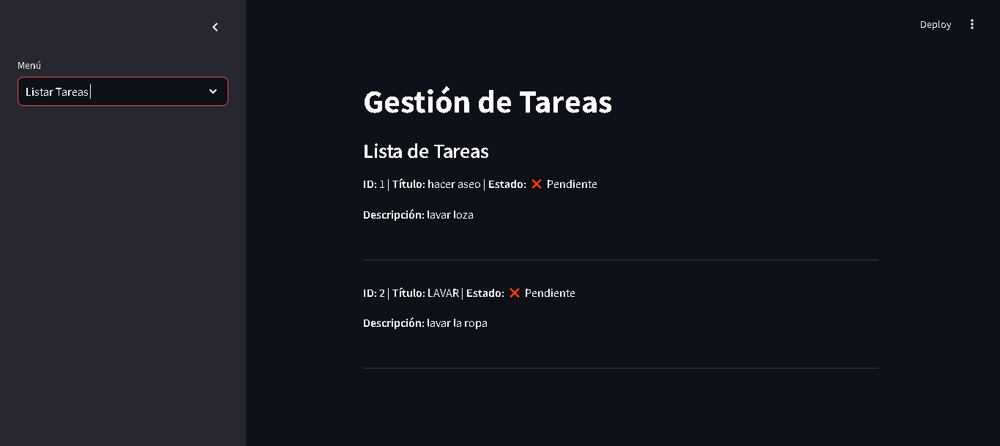
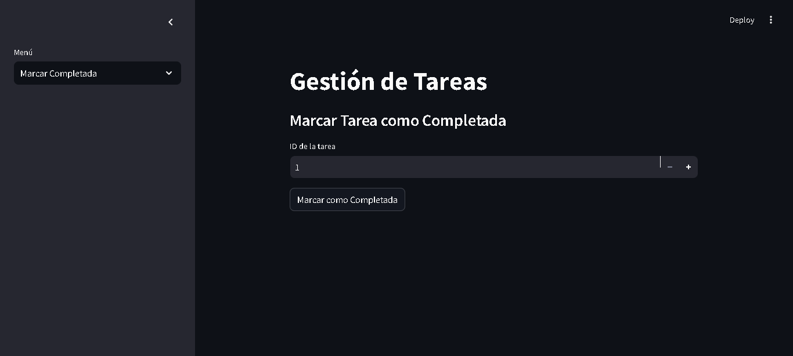
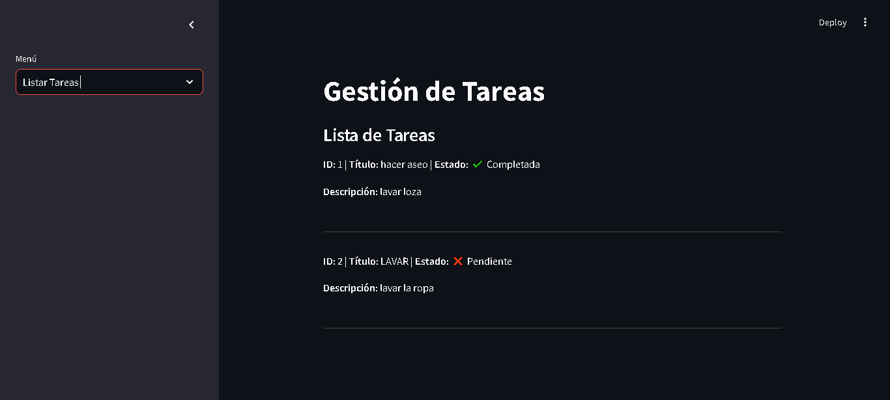
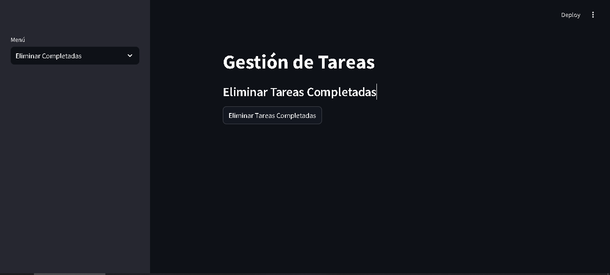

# Aplicación de Gestión de Tareas

Este es un proyecto sencillo que desarrollé para administrar actividades cotidianas con Python. La app te brinda la posibilidad de añadir tareas, visualizarlas, etiquetarlas como finalizadas y suprimirlas. Adicionalmente, tienes la posibilidad de exportar las tareas a un archivo JSON e importarlas si las requieres.

## Funciones de la aplicacion

Las funciones de esta aplicacion son  basicas y sencillas.

- **Agregar Tareas:** Puedes agregar nuevas tareas con un título y una descripción.
- **Listar Tareas:** Puedes ver todas las tareas con su estado (pendiente o completada).
- **Marcar Tareas como Completadas:** Las tareas se pueden marcar como completadas.
- **Eliminar Tareas:** Las tareas completadas o no necesarias se pueden eliminar.
- **Exportar e Importar Tareas:** Puedes guardar tus tareas en un archivo JSON e importarlas de nuevo cuando lo necesites.
- **Utiliza una interfaz gráfica:** Usé tkinter para crear una interfaz sencilla y fácil de usar.

## Requisitos

Para ejecutar la aplicación necesitas tener Python 3.12.2 instalado y algunas librerías que puedes instalar con **pip** o importarlas.

- Python 3.12.2
- sqlite3 (viene incluido con Python, no es necesario instalarlo)
- Instalar SQLite
-  importar streamlit
- importar JSON

## Ejecucion

**1. Como primer paso debemos instalar Streamlit.** 
- Abrimos la terminal y ejecutamos el siguiente comando para instalarlo.
pip install streamlit

**2. Ejecutamos el Streamlit.**
-  Para ello estando en la terminal navegamos hasta la carpeta donde se encuentra el archivo.py (nuestra aplicacion)
cd C:\Users\nombre_equipo\Desktop....
- y ejevutamos el siguiente comando
streamlit run app_tareas.py

**3.Interfaz ejecutada en el navegador.**

Una vez ejecutado el comando streamlit generará automáticamente una página en tu navegador. Y te mostrará unas URLS en la terminal:

# Screenshots

- **PANTALLA PRINCIPAL (Agregar nueva tarea)**

- **PANTALLA PRINCIPAL (muestra que una tarea se agrego)**

- **PANTALLA PRINCIPAL (Muestra el menu a la izquierda)**

- **PANTALLA LISTAR TAREAS (Muestra las tareas listadas)**

- **PANTALLA MARCAR TAREAS COMPLETADAS (Puedes marcar las tareas que ya han completado)**

- **PANTALLA LISTAR TAREAS (Muestra las tareas que ya se completaron y las que estan pendientes)**

- **PANTALLA ELIMINAR TAREAS (Puedes eliminar tareas)**

